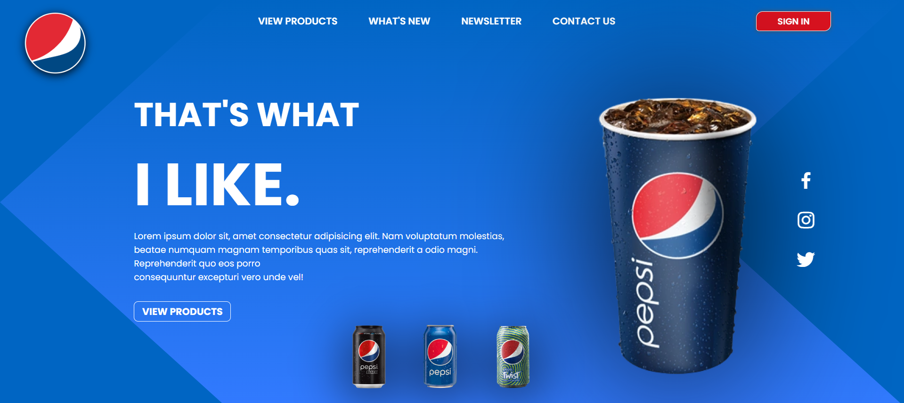

# PepsiLandingPage

> Uma landing page estática para a marca Pepsi, construída utilizando apenas **HTML** e **CSS** sem design responsivo.

## 📋 Descrição

Este projeto consiste em uma landing page da marca **Pepsi**, desenvolvida para demonstrar um design visual atrativo e moderno, focado em destacar o produto principal da marca. A página inclui imagens, textos estilizados e botões, e utiliza apenas **HTML** e **CSS** para sua construção. **Não há design responsivo**, então a página é otimizada apenas para telas grandes (desktop).

## 🛠️ Tecnologias Utilizadas

- **HTML5**: Estruturação do conteúdo da página.
- **CSS3**: Estilização e layout da página, incluindo cores, fontes e posicionamento dos elementos.

## 🎨 Funcionalidades

- Apresentação visual da Pepsi com imagens e textos de marketing.
- Botões de interação (sem funcionalidade de backend).
- Layout fixo, projetado para visualização em resoluções de desktop.

## 🚀 Como Visualizar

1. Clone este repositório:
   ```bash
   git clone https://github.com/seu-usuario/PepsiLandingPage.git
   ```

2. Abra o arquivo `index.html` em qualquer navegador para visualizar a página.

## 📂 Estrutura de Arquivos

```
PepsiLandingPage/
│
├── imgs/                   # Imagens utilizadas na landing page
│   └── logo.png
│   └── pepsi.png
│   └── pepsiAzul.png
│   └── pepsiPreta.png
│   └── pepsiVerde.png
│   └── telaPrincipal.png
│
├── index.css               # Arquivo de estilização principal
├── index.html              # Página principal da landing page
└── README.md               # Documentação do projeto
```

## 🖼️ Demonstração



## 🤝 Colaborador

<table>
  <tr>
    <td align="center">
      <a href="https://github.com/VictorSantuccii">
        <br>
        <sub>
          <b>Victor Santucci</b>
        </sub>
      </a>
    </td>
  </tr>
</table>

